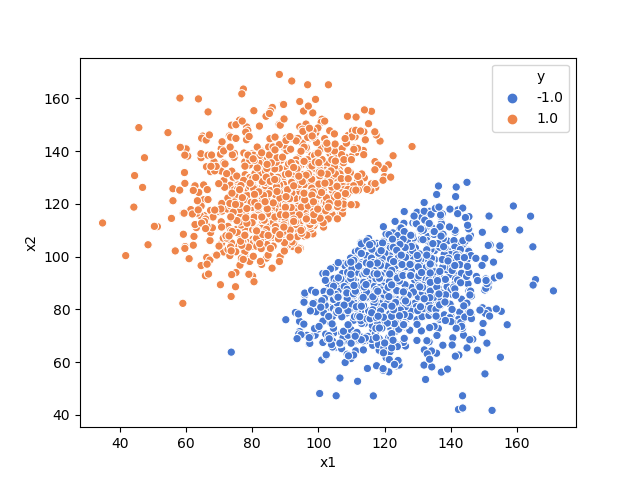
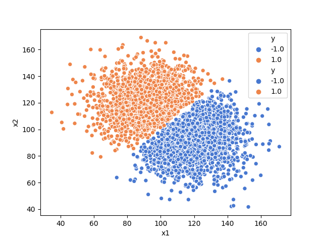

# Perceptron vs SVM

## Problem 1
The datasets we will be working on look like this:
1. A

1. B

Homework and data taken from:

    @course-materials{6.867 Machine Learning Fall,
      Author = {Tommi Jaakkola},
      Institution = {Massachusetts Institute of Technology},
      Downloaded on  = {21.05.2019},
      Site = {MIT OpenCourseWare(http://ocw.mit.edu/)}
    }
